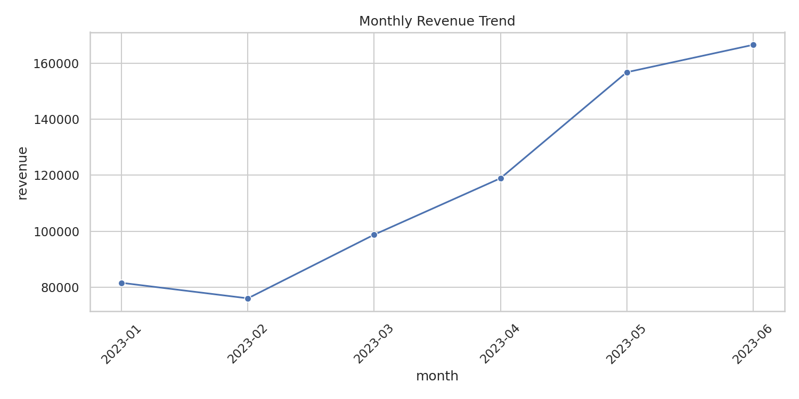
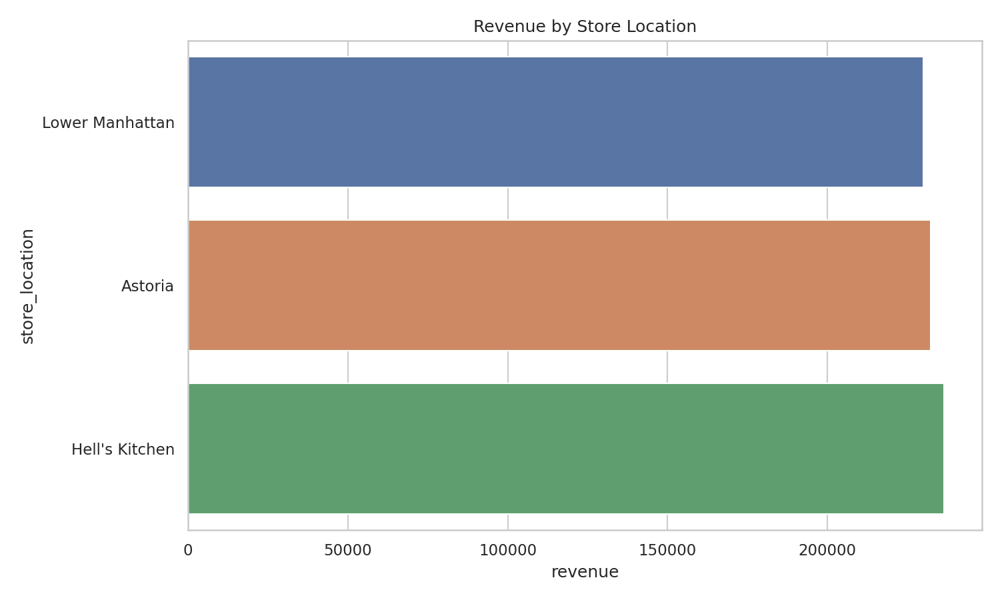
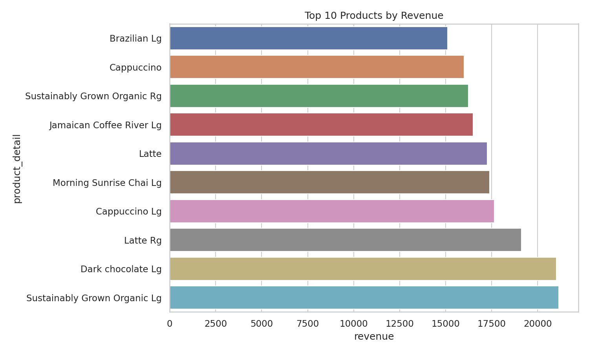
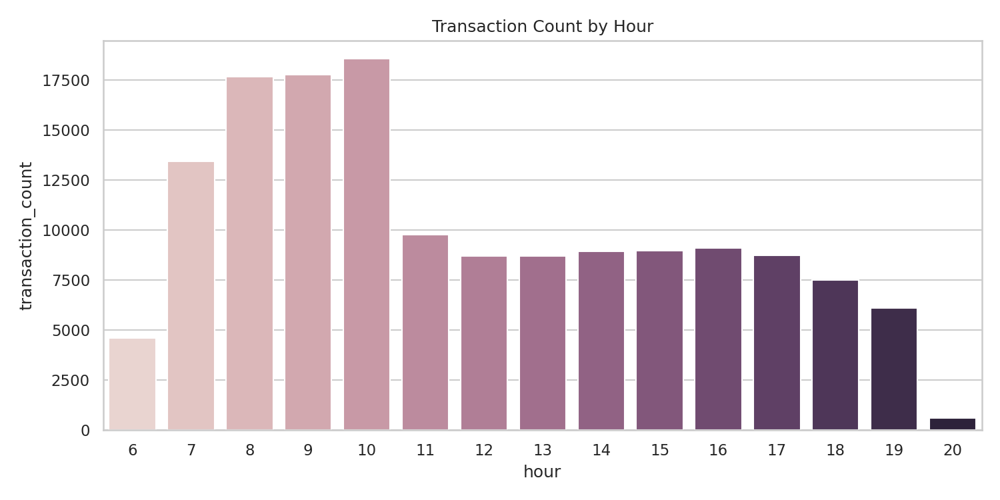

# Coffee-Shop-Sales-Data-Analytics-Project
A complete end-to-end data analytics project on coffee shop transaction data using SQL and Python.  The project covers data ingestion, SQL-based querying, Python-based analysis, and data visualization.

## 📂 Dataset
- **Source:** Coffee_Shop_Sales.csv
- **Records:** ~149,000 transactions
- **Columns:** transaction_id, transaction_date, transaction_time, transaction_qty, store_id, 
  store_location, product_id, unit_price, product_category, product_type, product_detail

---

## 🛠️ Tools & Technologies
| Tool | Purpose |
|------|---------|
| Python 3.x | Data processing & visualization |
| SQLite (via sqlite3) | SQL-based analysis |
| Pandas | Data manipulation |
| Matplotlib & Seaborn | Data visualization |

## 🔍 Key Business Questions Answered
1. What is the total revenue generated?
2. Which store location performs best?
3. What are the top-selling products by quantity and revenue?
4. Which product category dominates revenue?
5. What are the peak hours and days for transactions?
6. How has monthly revenue trended over time?

---

## 📊 Sample Visualizations
> *(Add screenshot images from your /output folder here)*

| Chart | Preview |
|-------|---------|
| Monthly Revenue Trend |  |
| Revenue by Store |  |
| Top 10 Products |  |
| Peak Hours |  |

---

## 💡 Key Insights
- **Total revenue:** $698,812.33 across 149,116 transaction records.
- **Highest-revenue store:** Hell's Kitchen with $236,511.17.
- **Highest AOV store:** Lower Manhattan at $4.81 per transaction row.
- **Largest revenue category:** Coffee with $269,952.45, representing 38.6% of revenue.
- **Top product by quantity:** Earl Grey Rg with 4,708 units.
- **Top product by revenue:** Sustainably Grown Organic Lg with $21,151.75.
- **Peak transaction hour:** 10:00 with 18,545 transactions.
- **Highest-revenue day of week:** Monday with $101,677.28.
- **Monthly trend:** Revenue increased from $81,677.74 in 2023-01 to $166,485.88 in 2023-06; the highest month was 2023-06 at $166,485.88.
- **Highest-revenue day:** 2023-06-19 ($6,403.91).
- **Lowest-revenue day:** 2023-01-28 ($2,037.10).
- **Data quality:** No null values or duplicate rows were found in the supplied dataset.

---

## 📦 Requirements
```text
pandas
matplotlib
seaborn
openpyxl
jupyter


**## Short Summary
This project is an end-to-end data analytics project developed using SQL, Python, Pandas, Matplotlib, and Seaborn to analyze approximately 149,000 coffee shop transactions.
The analysis covers the complete data analytics workflow:
Loaded the CSV dataset into SQLite for SQL analysis.
Performed data cleaning and validation using Python/Pandas.
Created calculated fields such as revenue, month, day of week, and transaction hour.
Used SQL to analyze revenue, stores, products, categories, monthly trends, peak hours, and customer transaction patterns.
Created 10 business-focused visualizations to identify trends and patterns.
Generated descriptive statistics and identified the highest and lowest revenue days.
Organized the entire project into a GitHub-ready structure with reusable Python scripts, SQL queries, visualizations, database, requirements, and README.

**## Key Findings
**Metric	Result
- Total Transactions	149,116
- Total Revenue	$698,812.33
- Highest-Revenue Store	Hell's Kitchen
- Highest-Revenue Store Revenue	$236,511.17
- Top Revenue Category	Coffee
- Coffee Revenue Share	38.6%
- Top Product by Quantity	Earl Grey Rg
- Top Product by Revenue	Sustainably Grown Organic Lg
- Peak Sales Hour	10:00 AM
- Highest-Revenue Day	Monday
- Highest-Revenue Month	June 2023

**## 📝 Project Conclusion

The Coffee Shop Sales analysis provides a comprehensive view of the business's sales performance, product demand, store performance, and customer purchasing patterns.
The dataset generated approximately $698.8K in revenue across 149K+ transactions, demonstrating a substantial volume of customer activity. Among the store locations, Hell's Kitchen generated the highest revenue, making it an important location for understanding successful sales patterns.
At the product-category level, Coffee was the largest contributor to revenue, accounting for approximately 38.6% of total sales. This indicates that coffee products represent a major component of the business's revenue stream. The product-level analysis also revealed differences between products that sell the highest number of units and products that generate the most revenue, demonstrating why both sales volume and revenue should be considered when evaluating product performance.
The time-based analysis showed that 10:00 AM was the busiest transaction hour, while Monday generated the highest revenue among the days of the week. Revenue also showed a strong upward pattern across the analyzed months, with June 2023 recording the highest monthly revenue.
The analysis can help the business focus on inventory planning, staff scheduling, product promotions, store-level performance monitoring, and revenue optimization. For example, staffing and inventory levels could be aligned with high-traffic periods, while product-level revenue and quantity metrics can be used to identify products requiring greater inventory attention or promotional strategies.
Overall, this project demonstrates how SQL can be used to efficiently extract business insights from transactional data and Python can be used to clean, analyze, visualize, and communicate those insights effectively.
